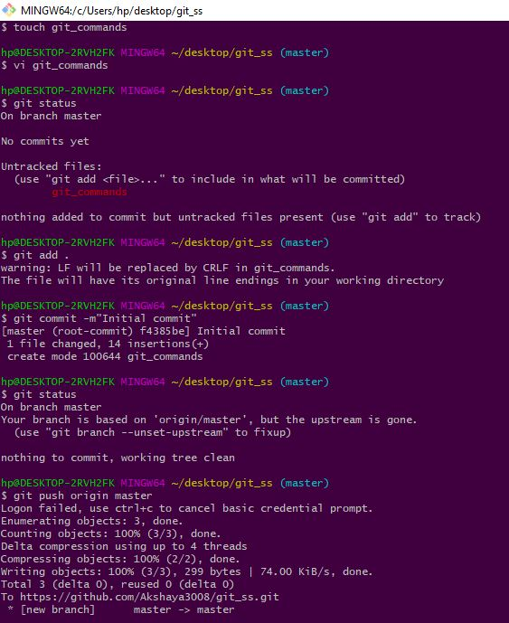

# Git Basics

- GIT is a distributed version control system.
-  It allows a number of developers to work on the same file without any conflicts.
- It provides speed and data integrity.

### Distributed Vs Centralized
|Distributed version control system| Centralized control system|
|--|--|
|1. It is a tool or process where multiple developers or teams can work together in the same repository|1. It is a tool or process where only one developer can work at a time.|
|2. Different users can update the same file.|2. Unless one developer updates the file and push it no one other than him can work on the same file|
|Example: GIT| Example: SBN|
### Git Commands
---
* git init: To create a repository.
* git status: Displays the state of the working directory and the staging area.
* git add < filename >: Adding file to git repository. This commands converts unstaged files to staged files.
    - git add . / * / < filenames >:
* git commit -m "< comment >": This registers file to git. This command converts staged files to committed file.
* git log: This command is used to view all the commits. Every time we commit new commit id is generated.
* git show < commit id >: Used to track the changes made to the file. The contents that are added to the file are highlighted in green and with a '+' symbol. The contents that are removed to the file are highlighted in red and with a '-' symbol.
* git diff < filename >: The command is used to view the changes made in a file that is still not committed.
* vim < filename >: To remove a file.
* nano < filename >: This command is used to add or remove content from a file.
* git branch: This gives us the branch name of the repo. by default it is master.
* git checkout < branch >: This command is used to switch to the mentioned branch.

### Git Workflow

### Step-by-step commands to merge a branch with another branch
---
* git status
* git pull origin master
* enter your username and password
* git checkout master
* git merge < branch name >
* git push origin < branch name >
* enter username and password