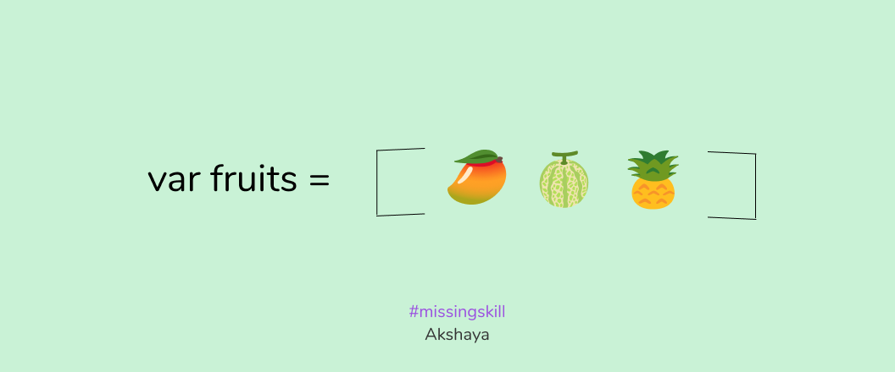

# Javascript

* It was called lightscript.
* It was developed by **Brendon Eich**.
* In 1996, Netscape Navigator open sourced Javascript and gave it to ECMA who renamed it to EcmaScript.
* JavaScript is the most popular language in the world. 
* JavaScript was developed as single thread.
* In Javascript everthing is an object.

### Tech Debt
- Javascript had certain "Tech Debts", some issues that can't be solved.
- Thet are as follows:
    -  '+' : It was added only for concatination but then browser decided to have mathematical calculation.
    - '==': By using this the expression "1"==1 was also true. So to fixed this '===' was used.
    - null: Brandon forgot to include null check so object was given as output for null check.

### Javascript variables
* Variables are containers that hold the data.
*  Js contains dynamic variables i.e. no need of compiling variables, we have to just declare it and the variables get evaluated at runtime.
* Type is defined when variable is assigned.
* variables are defined using var(functional scope) keyword. (ES5)
* const(cannot be reassigned), let(same as var) (lexical scope)(ES6)

*  Two types:
    1.  Primitive(variables that cannot be changed):
        - Boolean, string, numbers, null(no value assigned), undefined(normally used by js engine), symbol are the primitive types. 
        - Pass by value or copy by value.

    2.  Non-primitive(variables that can be changed): 
        - Array and object are non-primitive types.
        - Pass by reference or copy by reference.   
        

| var | let | const |
| ----------- | ----------- | ----------- |
| can be redeclared | cannot be redeclared | cannot be redeclared|
| can be reassigned |  can be reassigned | cannot be reassigned but non-primitive types can be reassigned |
| var has functional scope | has lexical scope | has lexical scope |
| ES5|ES6|ES6|
| Can be hoisted| Cannot be hoisted| Cannot be Hoisted |
|||It must be assigned when declared|

### JavaScript Functions

- In ES5 functions behave exactly like variables.
- Function is mainly a container.
- Function can be hoisted exactly like a variable.
- It has global and local scope.
- In JavaScript function are first class citizens and thus have all the privileges.
- As function is a container and contains something it has truthy value.

- We can define function as follows:  

    `` function <function_name>(){}``

### Functional scope
- Function has functional scope. 
- The function call will first check the local scope and then global scope.

```javascript
function fn_name(){
    console.log("20");                                    //this will be executed
}

function main(){
    function output(){
        console.log("from inside");
        fn_name();

        function fn_name(){
            console.log("200");
        }
    }
    console.log("from Outside");
    fn_name();
    }
    main();
```
### Lexical Scope
- It is a block inside functional scope.
- Anything that starts with curly braces has lexical scope.

```javascript
let a= 4;
if(a){
    let b=9;
    console.log(a+b);
}

function hello(){
    if (a){
        console.log(a+b);
    }
    else{
        console.log("Hello");
    }
}
```

### Function as a parameter/ reference:

This does not pass a function , it passes as a reference.   
 ```javascript
 function disp(myfun){
     return myfun;
 }
 console.log(disp("hello"));
 ```

### Anonymous Function
-  In function assignment,  
    ``var fn=function(){}``, function does not have a name, this type of function is called anonymous function.
```javascript
 var logicboard=function(){                   //anonymous function
     console.log("Anonymous function");
 }
 logicboard();                                         // calling anonymous function
```
- This function needs to be assigned to a variable inorder to be called.

### Function Short Circuit

- This is denoted by ()()().
- It is used for accessing inner function in a easy way.

```javascript
var hotel = function(){                                  // anonymous function
    var order = function(quantity){
        var items = function (itemname){
            return itemname;
        }
        return items;
    }
    return order;
}
var result = hotel()("one")("Pizza");             // function short circuit
console.log(result);
```

### IIFE

* Immediately Invoked Function Expression
* In a function assignment we assign function to a variable and then we call that variable to call the function.
* IIFE was developed so that function could act as a private method.
* It is also called as Self Executing Function Expression (SEFE).
* It will be runned only once.
* Cannot be called by any other party/developer other than the creator.
* put ; at the start of IIFE to safeguard it.

### Inline function

- When we pass value directly as parameters while calling the function, the parameters are called inline parameters.
- We can pass function as parameters too, such functions are called inline functions.
- Inline function is always unnamed function, anonymous function and function expression.


### Arrow Function
- In ES6 we do not have function decration,we only have function expression or assignment.
- There is no need of 'function' keyword, you add '( ) ==>'.
- This is called arrow function.
- Arrow function cannot be hoisted.
- In arrow function, if there is only a single parameter to be passed no need of using '( )'.

    ```javascript
    let b = (param) => {
        console.log("Arrow", param);
    }  
     b(10);                                                 // the value 10 will be passed to the param.
     ```


### Hoisting

- In Javascript, it is a default behaviour in which the variable declaration part is taken to the top of the code.


### Constructors and Prototypes

- Function can be converted into class i.e. prototype.
-  Prototype is an object. It is the implementation of class structure.
- Example:  
``var samal = new Person();``  
where, samal is variable and Person is the function.

- When we add the 'new' keyword the function becomes constructor/ object prototype.
- Prototype was created to mimic the concept of  OOP in Javascript.

###  this Keyword

-  It is explicitly a function constructor.
- Used for creating class from the function.
- This is called by using 'new' keyword.

```javascript
function Person(name,age){ 
    this.name=name;
    this.age=age;
}
var samal = new Person("Samal",12);   //constructor object
var arup = new Person("Arup",22);
console.log(samal);
```

### Built-in constructor types

- **Array**:
 
    - Array is an index-based object.
    - We can read content of array using index.  
            ``
            var fruits = ["Apple","Muskmelon", "Pineapple"];
            ``      
               
    Some built-in functions provided by array constructors:

    |Method name| Use|Example|
    |--|--|--|
    |1. push()| To add elements at the end of array.| fruits.push("Grapes");|
    | 2. pop()| To remove elements from the end of array.|fruits.push()|
    |3. unshift()| To add elements at the beginning of array.| fruits.unshift("Watermelon");|
    |4. shift()|  To remove element from the beginning of an array.| fruits.shift();|
    |5. concat()| To merge contents of two arrays.|fruit.concat(vegetables);|
    |6. map()| Used for transforming contents of an array.| fruits.map(mapfn);
    |7. length()| It gives the length of the array.| fruits.length()|
    |8. forEach()|Used for accessing the elements of an array without using the for loop.|fruits.forEach(loops);|
    |9. filter()|To filter out an array.| fruit.filter(filterfn);|
    |10. indexOf()| Returns the index of specified element.|var indexeg=fruits.indexOf(2);

- **Object:**
    - Object can be created in the following way:
        - ``var obj={}`` //literal notation

    Methods:
    |Name| Use|
    |--|--|
    |1. Object.keys()| It is used to find the number of keys present in the object or to operate on keys.|
    |2. Object.create()|It is used to create an object|
    |3. Object.freeze()|It will prevent the value of the object from changing.|
    |4. Object.assign()| It assigns the values of an array to another array.| 

- **String:**
-  ``var text="This is about String Constructor";``  

    Methods:

    |Name| Use|
    |--|--|
    |1. toUpperCase()| It prints the entire string in upper case.|
    |2. toLowerCase()| It prints the entire string in lower case.|
    |3. split()|It splits the string using the specified dilimiter.|
    |4. join():| It joins the string using the specified dilimiter.| 
    |5. replace():| It replaces the string with the specified string. |
    |6. trim():|It removes the unwanted spaces. |
    |7. substr():|It prints the string from the specified index.|
    |8. charAt():| It returns the character at the specified index.|

### Built-in Methods

- setTimeout(): This function is used to delay the execution of a function for certain amount of time.  
Example: application to load, page setup to complete.
    
    `` setTimeout(after, 2000); ``

- setInterval(): This function creates a timer loop. It is used to run a code that needs to be executed continously.

    `` setInterval(after, 2000);``
- parseInt(): This function is used to convert a value to integer.

    `` parseInt(weight);``
- parseFloat(): This function is used to convert a value to float.

    `` setTimeout(weight);``        

### JSON
- It is an object.
- It is used to convert object to JSOn and vice-versa.
- If a value needs to be send ouside a apllication it is sent as JSON.

### ES6 features

- Spread Operator(...):
    - Spreads all the primitive value in an array into individual elements.
    - It is used instead of assign() of ES5.
    - It improves readability.

- Destructure:
    - This feature extracts the keys from object and uses it.
    -  It needs the exact name of the key for execution.
    - It reduces the number of lines in a code.
    - It is used for accessing data easily from a nested array.

- String Literal ('  '):
    - It is used to do concatination very smoothly.
    - Example:
    ```javascript

    let firstname="Shama";
    let secondname="Hegde";
    let stringname= '${firstname} ${lastname} ';     
    ```
       