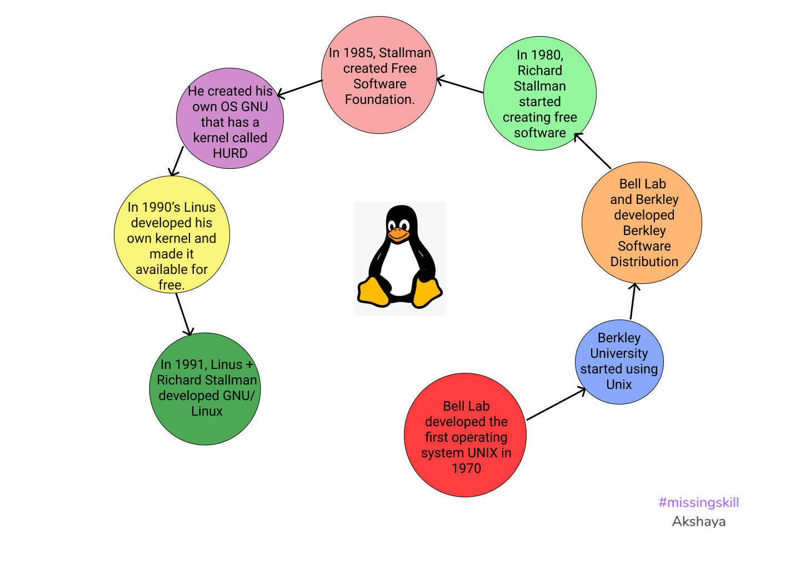
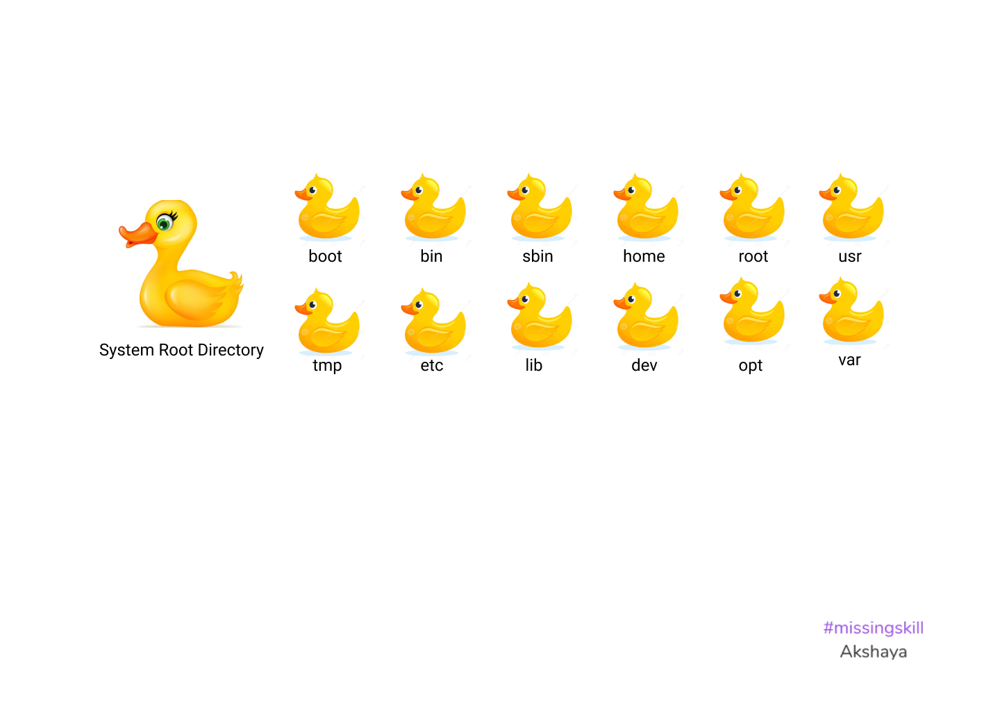

# Linux

- Linux is basically a **kernel**.
- A kernel is software or code that interacts with hardware. 

### Linux History

### Linux Commands
---
|Commands|What it does|
|---|---|
| 1. ls:|This lists all the files and folders in the current directory.|
| 2. cat :| This command is used to write into a file or read from a file.|
| 3. pwd :| It prints the path of the present working directory.|
| 4. who :| It prints all the active logged-in users.|
| 5. whoami :| It prints the currently logged-in user.|
| 6. touch :| This command is used to create a new file.|
| 7. man :| It is used to learn about commands and their flags with detailed descriptions.|
| 8. clear / Ctrl + L :| It is used to clear the terminal.|
| 9. cd :| This command is used to change the directory.|
| 10. mkdir : |This command is used for creating a directory.|
| 11. rmdir:| This command is for removing/ deleting a directory that is empty.|
| 12. mv :| This command moves and renames files and directories.|
|13. history :| This command prints the list of all executed commands.|
|14. echo : |This command is used to print a message or system variable.|
|15. exit : |This command is used to exit from the terminal.|
|16. which < command name > :| This command gives us the location of installed software or command.|
|17. wget :|  Command-line browser.|
| 18. less : |It shows only some content of a large file.|
|19. more:| Loads the whole file from the memory and displays it.|
| 20. top :| This command shows the load of the system or the current utilization.| 
| 21. ps :| This command is used to show the running application.|
| 22. tail:| This command is used to read a file. This command does continuous reading.| 
  
#### Flags:

|Commands| Flags| What it does|
|---|--|--|
|ls|  ls -l|It lists all the files and directories more descriptively. It shows information such as the permissions, owner, size, etc related to the files and directories.|
||ls- t|It arranges the contents in the directory in ascending order. The latest one will be at the top.|
||ls -h|h stands for human readable. It displays the size of the file or directory in human-readable form.|
||ls -r|It arranges the contents in the directory in reverse order.|
||ls -F|It is used to easily identify a directory. It assigns / at the end of the directory name.|
||ls -a|It shows the hidden files in the directory.|
|cat|cat  < filename > |Used to read from a file.|
||cat > < filename >|Used to write into a file. This command overwrites existing data.|
||cat >> < filename >|Also used to write into a file. This command prevents overwriting in a file and adds new data after the existing data.|
||cd + Enter / cd + ~|It takes us to user's home folder.|
||cd + -|It takes back to the previous folder/ directory.|
||cd ..|It takes one step back.|
||cd < folder name >/|This command takes us to the specified folder.|
|mkdir|mkdir < directory / sub-directory >|This command is used to create directory and sub-directory simultaneously.|
||mkdir < directory name > < directory name > < directory name >|This command is used for creating many directory at the same time.|
|rm|rm -rf < directory name >|This command is for removing/ deleting directory that is not empty.|
||rm < filename >|This command is for removing/ deleting file.|
||rm *|This command is for removing/ deleting all the files within a directory.|
||rm < directory name > / < filename >|This command deletes the specific file in a directory.|
||rm -rf  *|This deletes all the files and directory within the present working directory.|

 

### Linux File System

-  Everything in Linux is file

- / : This is the system's root directory.
     - /boot:  The system kernel is located here. All the kernel configuration and application related to the kernel is also present.
          - /grub: This is the boot loader. It picks up the file system and the kernel.
     - /bin: We can find binary files inside this directory. User-level applications are stored here.
     - /sbin: System binaries are stored here that are used by the system admin.
     - /home: When a new user is added the folder for the user is created here. User related data are stored here.
     - /var: This is where system level variables are stored. The log file, temporary files and configuration files that are not critical to the system are stored here. 
     - /usr: Normal user related resources or information are stored here.
     - /root: All the resources related to the root user are present here and only the root user has access to this.
     - /tmp: This is used when system wants to store something temporarily.
     - /etc: System configurations are stored here.
     - /lib: System libraries are stored here.
     - /dev: It is kind of a memory file. When we have external devices like RAM/ USB/ external mouse and keyboard get attached here.  
     - /opt: All the data related to softwares installed by user are stored here.

:small_red_triangle: **Additional Information:**
1. In linux there are no extensions needed as everything is a file.
2. We can do anything in our folder and not in our folder and not in /home.
3. When a nix machine starts it always looks for the /boot folder as kernel is present is in this folder.
4. A root user is denoted using '#' and a normal user is denoted using '$'.
